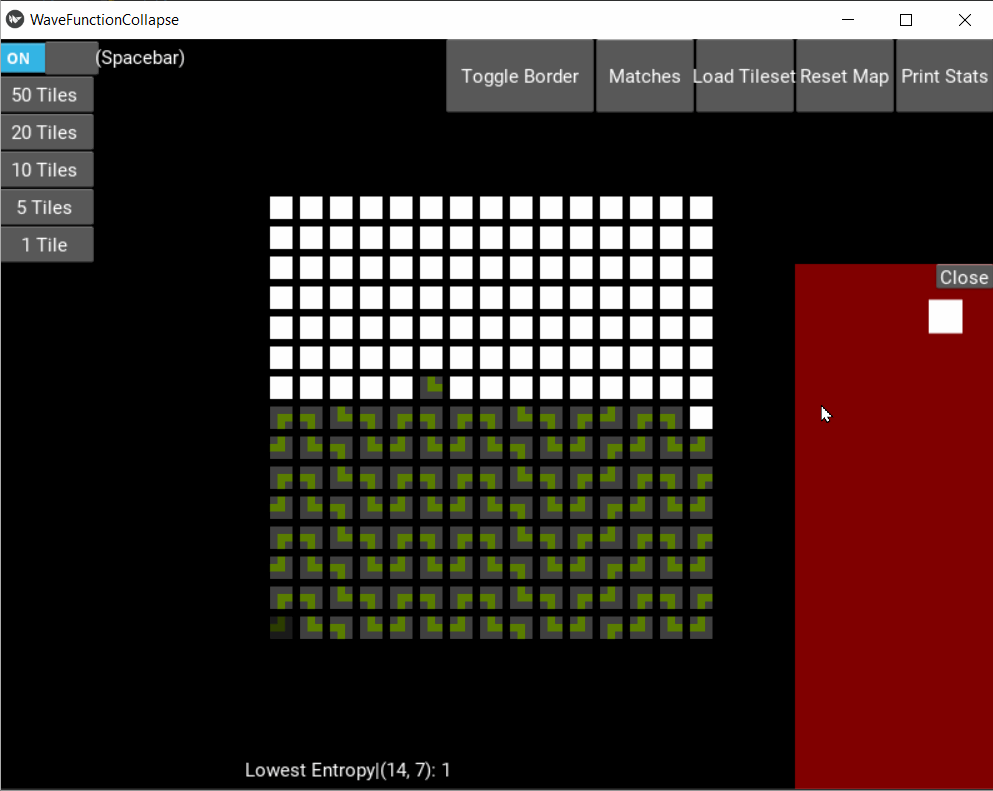
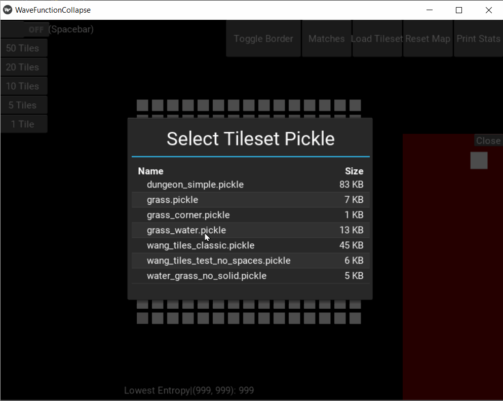

# kivy-wfc
Wave Function Collapse Using Kivy Python
## Current Progress 11/06/2021
For simple tile sets, the tile resolves beautifully:


Complex ones, however, still has issues with ##impossible-to-constrain tiles:

## Inspiration
My understand of WFC comes from a paper I read from [Isaac Karth](https://procedural-generation.isaackarth.com/2019/03/05/wavefunctioncollapse-and-you-i-recently-put.html).
## Installation
```
git clone https://github.com/Sunnigen/kivy-wfc.git
cd kivy-wfc
main.py
```
