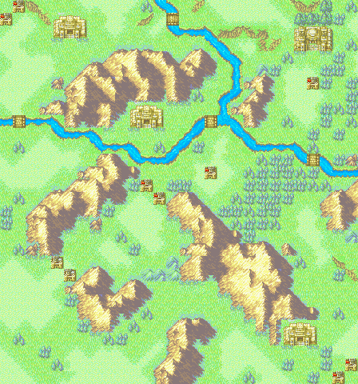
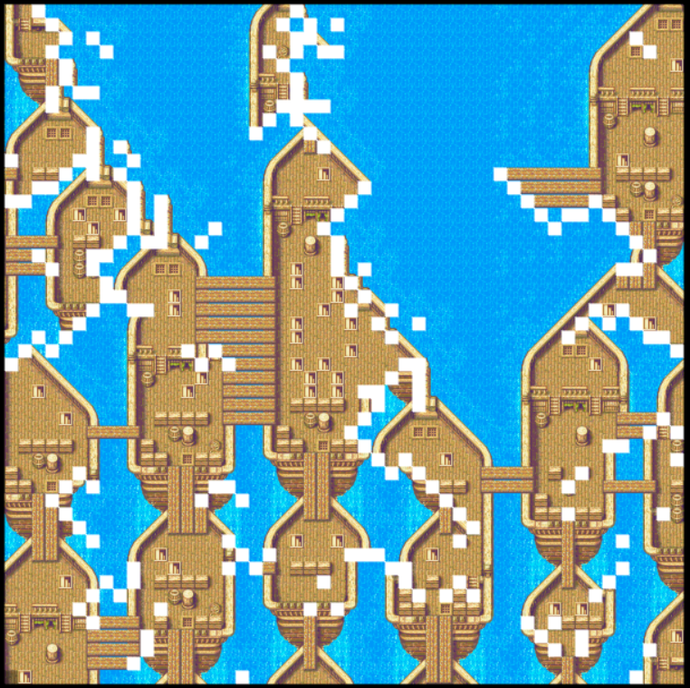
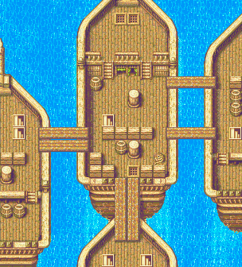

# kivy-wfc
Wave Function Collapse Using Python with Kivy as Visualizer
## Current Progress 11/25/2021
Attempted other tiles maps(Fire Emblem 7 GBA). The contradictions come from the fact that the input map doesn't cover every instance of tile patterns, which causes some contradictions:


Below is its input map:




Here is another instance, a sea boat map(Fire Emblem 7 GBA):


Below is its input map:



## Next Steps
1. Backtracking to remove contradictions.
2. There are some tile patterns that do not have a match in a certain direction(N, S, W, E). I need to find a way to make it work. 
## Inspiration
My understand of WFC comes from a paper I read from [Isaac Karth](https://procedural-generation.isaackarth.com/2019/03/05/wavefunctioncollapse-and-you-i-recently-put.html).
## Installation
```
git clone https://github.com/Sunnigen/kivy-wfc.git
cd kivy-wfc
main.py
```
Note: There are other tilesets that are packaged. Press the **Load Tileset** button.
 
